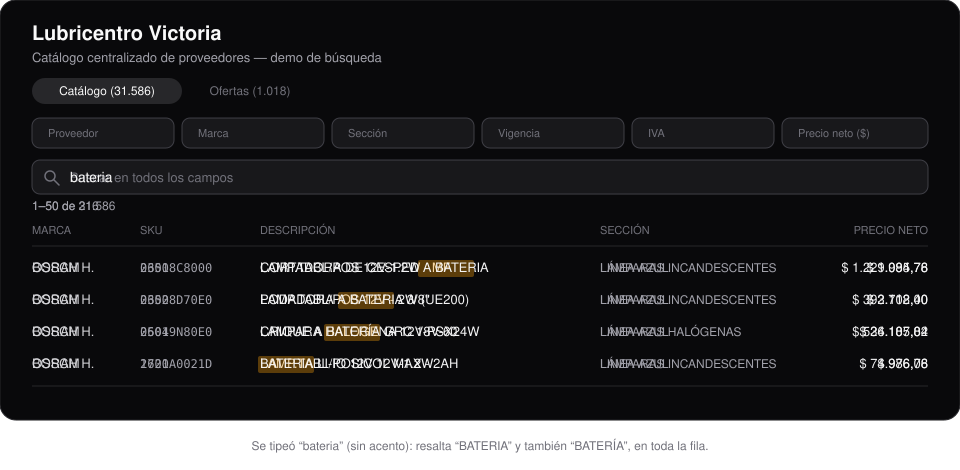

# Lubricentro Victoria — Catálogo de proveedores

Aplicación web para visualizar y filtrar el catálogo centralizado de listas de precios y ofertas de los proveedores del lubricentro (Bosch, Mobil, Tecfil, Wega, O'Cuatro, entre otros), ya normalizados a partir de sus archivos originales.

## Demo



Al tipear en el buscador se filtran **todas** las columnas de la tabla (no solo SKU/Descripción), la comparación **ignora acentos** (`bateria` encuentra tanto `BATERIA` como `BATERÍA`) y las coincidencias se resaltan en toda la fila.

## Acceso

La app no tiene login: cualquiera que la abra entra directo al catálogo con
acceso completo (cargar archivos, editar, eliminar). El backend tampoco
autentica — si hace falta restringir el acceso, va a nivel de red (allowlist
de IPs, VPN o basic auth en el reverse proxy), ver `../infra/README.md`.

## Funcionalidades

- **Catálogo** (`/`, pestaña "Catálogo"): filtro por columna en cada encabezado — texto libre en Proveedor/Marca/SKU/Descripción/Vigencia, combobox con búsqueda en Sección (los valores salen de `GET /api/productos/secciones`), rango Mín/Máx en Precio neto y Precio c/IVA, igualdad exacta en IVA %.
- **Ofertas** (pestaña "Ofertas"): mismos filtros por columna (rango Mín/Máx en Descuento y Precio unitario). La columna "Válida hasta" muestra la fecha de vencimiento de cada oferta (o "Hasta agotar stock" si no tiene) y su filtro combina un select categórico (Todas / Hasta agotar stock / Con fecha de vencimiento — `f_vigencia` en el backend, porque `fechaHasta: null` no se puede filtrar con texto) con un date picker de fecha exacta (`f_fechaHasta`).
- **Ordenar por columna** (ambas pestañas): click en el nombre de la columna cicla ascendente → descendente → orden por defecto (última carga primero). El orden lo aplica el backend (`?sort=&order=`, whitelist por tabla — ver `../backend/README.md`).
- **Filas por página**: selector 50/100/200 junto al contador de resultados, en ambas pestañas.
- **Exportar** (ambas pestañas): botón junto al buscador con menú Excel (.xlsx) / CSV (.csv). Baja el **resultado filtrado completo** (mismos filtros y orden que la tabla, sin paginar) desde `GET /api/productos|ofertas/export` (`ExportarButton.tsx` + `apiDownload` en `lib/api.ts`). El CSV viene preparado para Excel es-AR (separador `;`, decimales con coma, BOM UTF-8).
- **Estado y cierre de ofertas** (pestaña "Ofertas"): columna "Estado" con badge Activa / Cerrada (cierre manual) / Vencida (`fechaHasta` pasada, calculada con fecha local, no UTC). Switch "Ver cerradas/vencidas" (`?incluirCerradas=true`). Con filas seleccionadas aparecen "Marcar agotada" / "Reactivar" según lo que haya en la selección — usan los `POST /api/ofertas/cerrar|reactivar` existentes, que operan por (proveedor, n° oferta, SKU): **cierran todos los tramos de cantidad de ese SKU**, incluso los no seleccionados (avisado en la UI).
- **Papelera** (ambas pestañas): switch "Ver eliminados" que cambia la tabla a **solo** las filas borradas (badge "Eliminado" + fila atenuada). En ese modo la barra de selección ofrece únicamente **Restaurar** (`POST /api/productos|ofertas/restaurar`); Editar/Eliminar quedan ocultos.
- **Historial de precios** (ambas pestañas, cualquier rol): botón ⟳ al final de cada fila que abre un modal con la evolución del precio de ese SKU (catálogo: por proveedor+marca+SKU; ofertas: por tramo proveedor+SKU+desde cantidad) — gráfico de línea SVG propio (`HistorialChart.tsx`, sin librería de charts) más la tabla completa con fecha de carga, precios, archivo de origen y estado (`HistorialProductoDialog.tsx` / `HistorialOfertaDialog.tsx`, `GET /api/productos|ofertas/:id/historial`).
- Todos los modos de filtro (texto, select, combobox, rango, fecha) conviven en `ColumnFilterHeader.tsx` vía props opcionales (`options`, `searchOptions`, `rangeValue`/`onRangeChange`, `dateValue`/`onDateChange`, `sortDirection`/`onSortToggle`). El ícono de filtro (embudo) siempre queda a la derecha del de orden en todas las columnas, incluidas las alineadas a la derecha (precios, cantidades) — el contenedor usa `justify-end` para empujar el grupo al borde de la celda sin invertir el orden de los ítems (antes usaba `flex-row-reverse`, que además de posicionar invertía el orden visual).
- Todos los filtros son **combinables** entre sí con lógica AND (cada uno reduce más el resultado sobre el anterior), incluyendo el buscador de texto libre.
- El buscador compara sobre **todos los campos** de cada fila (no solo SKU/descripción) y es **insensible a acentos**, sin modificar el texto original que se muestra en pantalla.
- Las coincidencias se **resaltan** en cualquier columna donde aparezcan.
- Filas con datos del proveedor que no entran en el schema canónico se pueden expandir para ver el `raw_data` original.
- Tema claro/oscuro automático según preferencia del sistema operativo.
- **Editar y eliminar filas** (`/`, ambas pestañas): cada fila tiene un
  checkbox de selección, más uno en el header para seleccionar todas las filas de la página
  actual (no todo el resultado filtrado). Con filas seleccionadas aparece una barra con:
  - **Editar**: con 1 fila seleccionada abre un formulario con todos sus campos editables
    (`EditarProductoDialog.tsx` / `EditarOfertaDialog.tsx`, `PATCH /api/productos|ofertas/:id`);
    con más de una, abre un diálogo de edición en lote que aplica un mismo valor a un único campo
    de una lista reducida de campos "seguros" (`BulkEditarProductoDialog.tsx` /
    `BulkEditarOfertaDialog.tsx`, `POST /api/productos|ofertas/editar-lote`) — no incluye campos
    identificadores como marca/SKU/descripción, para no corromper datos al aplicar en lote.
  - **Eliminar**: pide confirmación y hace un borrado **lógico** (`POST
    /api/productos|ofertas/eliminar`, marca `eliminado: true`) — la fila deja de aparecer en la
    UI pero nunca se borra físicamente de la base.

  Ver `../backend/README.md` para las listas blancas de campos editables y el detalle de cada
  endpoint.
- **Crear producto/oferta a mano** (`/`, ambas pestañas): botón "Nuevo
  producto"/"Nueva oferta" junto al buscador, en paralelo al pipeline de carga masiva por archivo
  — para dar de alta una fila suelta sin pasar por `/cargas`
  (`NuevoProductoDialog.tsx`/`NuevaOfertaDialog.tsx`, `POST /api/productos|ofertas`). El campo
  Proveedor es un combobox con búsqueda que además permite escribir un nombre nuevo
  (`ProveedorCombobox.tsx`, extraído del mismo patrón que ya usaba `UploadForm.tsx` — el backend
  lo crea si no existe). En Ofertas, "Desde cantidad" y "Descuento %" son opcionales (vacío = 1 y
  0%, mismo criterio que una fila de archivo) y el resto de los campos obligatorios los exige el
  propio input (`required`) antes de tocar el backend.
- **Imagen por fila** (`/`, ambas pestañas): miniatura como primera columna de la tabla
  (placeholder gris si no tiene foto). Se sube/reemplaza/quita desde el diálogo de alta o de
  edición (`POST`/`DELETE /api/productos|ofertas/:id/imagen`, JPG/PNG/WEBP hasta
  5MB) — la subida es una acción aparte del resto del formulario, se dispara apenas se elige el
  archivo y no espera al botón "Guardar". `imagenSrc()` (`app/lib/api.ts`) arma la URL completa a
  partir de la ruta relativa que devuelve el backend.
- **Cargar archivo** (`/cargas`): habla en vivo con el backend (`../backend`, Express + Prisma).
  Subís un archivo (imagen, PDF o excel) de un proveedor, se procesa con IA, y antes de guardar
  nada se muestra una pantalla de revisión donde se puede corregir el mapeo de columnas y
  cualquier valor extraído a mano — ninguna carga se publica sin confirmación humana. Esa misma
  pantalla (`ReviewTable.tsx` / `ReviewTableOfertas.tsx`) marca con ⚠ las filas con advertencias
  (precio en cero, SKU/tramo duplicado, salto de precio anómalo, campos obligatorios faltantes en
  ofertas — ver `../backend/README.md`) calculadas por el backend al abrir la pantalla; son solo
  informativas, no bloquean la confirmación. Requiere el backend corriendo
  (`NEXT_PUBLIC_API_URL`, default `http://localhost:4000`, ver `.env.local`).
  - **Mapeo de columnas uno-a-muchos**: cada columna de origen tiene un `<Select>` primario y,
    debajo, un segundo `<Select>` opcional (`MAPPING_SELECT_ITEMS_SECUNDARIO`) para asignarle un
    segundo campo destino a la vez (ej. una columna "Código" que llena `sku_interno` Y
    `sku_proveedor` con el mismo valor) — los dos selects filtran mutuamente sus opciones para no
    poder repetir el mismo destino en la misma columna. Sigue funcionando también al revés (varios
    orígenes al mismo destino, ej. "Descripción" alimentada por dos columnas): los valores se
    concatenan con un espacio, en el orden en que aparecen en el archivo, salteando vacíos — salvo
    `sku_interno`/`sku_proveedor`, que se concatenan sin separador (reconstruyen un código partido
    en dos columnas). Mismo criterio en los dos lados: `applyMappingPreview.ts` /
    `applyMappingPreviewOfertas.ts` en el frontend (vista previa instantánea, antes de confirmar),
    `applyMapping`/`applyMappingOfertas` en `../backend` (ver su README, sección "Extracción").
- **Auto-descargas** (`/cargas/auto-descargas`, `AutoDescargasView.tsx`): CRUD de
  las marcas que se descargan solas a diario (`GET`/`POST`/`PATCH`/`DELETE /api/auto-descargas` —
  ver `../backend/README.md`, sección "Automatización") — proveedor, marca, % de ganancia default
  y un switch para activar/desactivar sin borrar la fila. "Probar ahora" corre esa fila al toque
  (~10-20s si el proveedor usa portal por Playwright, más rápido si es descarga directa) y
  refresca "Última corrida"/"Resultado" en la tabla sin recargar la página. El badge de Resultado
  linkea a la carga creada (`/cargas/:id`) cuando el resultado es `carga_creada` o
  `publicado_automaticamente` — este último significa que, además de crearse, la carga ya se
  publicó sola sin pasar por revisión humana (ver "Auto-publicación condicionada" en
  `../backend/README.md`); el link sirve igual para poder auditar qué se publicó.
  - **"Hasta agotar stock"** (solo tipo "Oferta"): switch en `UploadForm.tsx`, debajo del
    selector Catálogo/Oferta. Si está activo, se manda `sinFechaLimite: true` al crear la carga y
    la IA no intenta inferir una fecha de vencimiento del documento (evita alucinaciones) —
    `metadataOferta.fecha_hasta` queda `null` directamente. Ver `../backend/README.md`
    (`Carga.sinFechaLimite`) y `../contexto.md` (sección "Vigencia de catálogo y ofertas").
  - En la revisión de ofertas (`ReviewTableOfertas.tsx`), los campos de archivo "Fecha oferta",
    "Hora oferta" y "Válida hasta" usan inputs nativos `type="date"`/`type="time"` (calendario y
    reloj del navegador; el backend ya genera esos valores en `YYYY-MM-DD`/`HH:MM`, así que son
    compatibles sin conversión). "Válida hasta" puede quedar vacío = hasta agotar stock. En la
    tabla de filas, "Desde cantidad" y "Descuento %" son opcionales: si quedan vacíos, el backend
    infiere `1` y `0` al confirmar (placeholders "vacío = 1" / "vacío = 0" en la celda).
- **Catálogo y ofertas vigentes** (`/cargas/gestion`): pantalla mínima, también contra el backend
  real, para ver el precio actual por SKU (`ProductoPrecio.vigente`) y las ofertas activas, y
  cerrar/reactivar una oferta ("marcar agotada") cuando se acaba el stock — ver `../contexto.md`,
  sección "Vigencia de catálogo y ofertas".

## Stack

- [Next.js](https://nextjs.org) (App Router, Turbopack) + React + TypeScript
- Tailwind CSS v4
- [shadcn/ui](https://ui.shadcn.com) sobre [Base UI](https://base-ui.com) (`style: base-nova`)

## Getting Started

```bash
npm install
npm run dev
```

Necesita `.env.local` con `NEXT_PUBLIC_API_URL` y el backend corriendo
(ver su README).

Abrí [http://localhost:3000](http://localhost:3000).

## Despliegue

En producción corre en Docker (`Dockerfile`, build standalone — requiere `output: "standalone"`
en `next.config.ts`), detrás de un nginx que enruta por path sobre un único puerto público (sin
dominio, acceso por IP pública) — arquitectura completa en `../infra/README.md`.

`NEXT_PUBLIC_API_URL` se hornea en el bundle en build time, no en runtime: en el
`docker-compose.yml` de `infra/` entra como build-arg, no como variable de entorno del
contenedor. Es la única variable que necesita el frontend, así que no lleva `.env` propio.

## Datos

`/` (Catálogo/Ofertas), `/cargas` y `/cargas/gestion` leen todas del backend real (`../backend`,
Express + Prisma) vía `apiFetch` (`app/lib/api.ts`) — no hay ninguna vista que dependa de datos
locales al frontend. `app/lib/productos.ts` y `app/lib/ofertas.ts` solo exponen los tipos
(`Producto`/`Oferta`, con el mismo shape camelCase que devuelve la API) y las listas blancas de
campos editables, ya no cargan ni consultan JSON.

`data/productos_todos.json` y `data/ofertas.json` son un snapshot del prototipo original —
ya no los lee ningún código del proyecto, se pueden borrar sin impacto.
